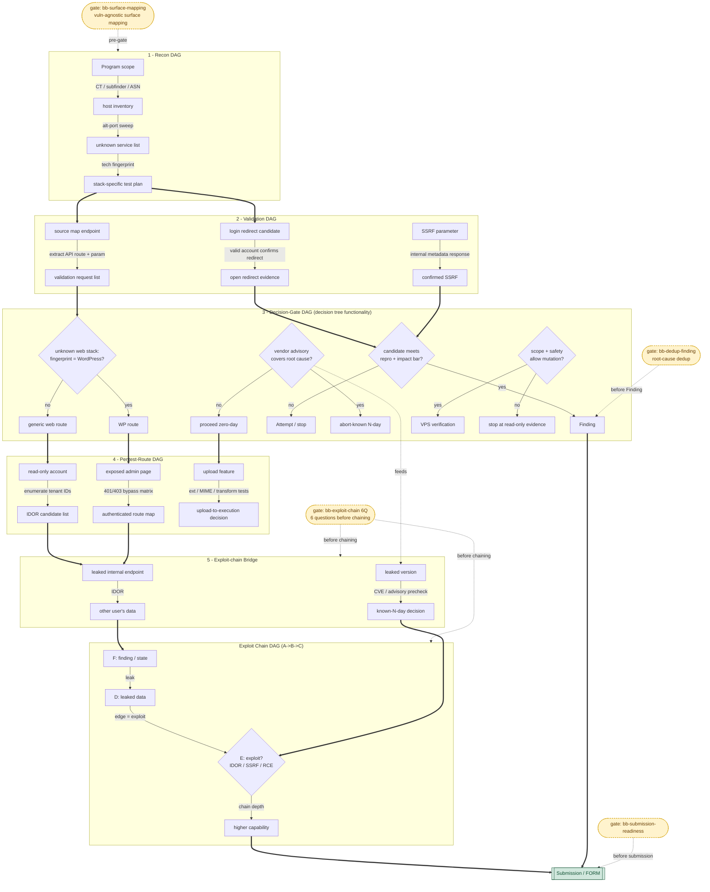

# Diagram — Target Work DAG Lifecycle

> [!info] All targets must have a DAG (mandatory)
> The DAG is a record, not a driver. Even a single finding / small target should have one — track coverage and chaining possibilities.

Visualizes the complete recon→exploit→submission lifecycle of the "effectiveness-first DAG", connecting the 5 lanes from [[Template - Target Work DAG]]
(Recon / Validation / Decision-Gate / Pentest-Route / Exploit-chain-Bridge) with [[Template - Exploit Chain DAG]]
into a single diagram. **The Decision-Gate lane uses decision diamonds** — the decision-tree functionality has been merged into the DAG (multi-path merge, shared evidence, cross-session accumulation),
so there is no separate decision tree. Skill gates (surface-mapping / exploit-chain 6Q / dedup / submission-readiness) are attached as dashed annotations at the corresponding handoff points.



## Legend

| Shape / Edge | Meaning |
|---|---|
| `[rectangle]` | State / asset / evidence node (lane's `from`/`to`) |
| `{diamond}` | Decision-Gate fork — decision tree's verifiable condition (`edge = decision condition`) |
| `[[double-frame]]` | Terminal: Submission / FORM |
| `([rounded dashed])` | Skill gate annotation (not data flow, attached at handoff point) |
| `==>` thick solid | Hand-off between lanes (evidence / path selection) |
| `-->` thin solid | Intra-lane edge (discovery / criterion / action / exploit) |
| `-.->` dashed | Gate mount point / auxiliary feed |

**Lane mapping**: 1 Recon = surface coverage; 2 Validation = decompose suspicions into falsifiable conditions; 3 Decision-Gate = choose next step (decision tree function, kept in DAG because paths merge/share evidence/accumulate across sessions); 4 Pentest-Route = from access to foothold; 5 Bridge = move chainable findings into formal chain tracking.

## Using with `dag_gaps.sh`

This diagram is the **structure** (which lanes exist, how they connect); each actual target instantiates it as an edge-list table (`| from | edge | to | status |`) in files containing `DAG` in the filename under `01 - Targets/<target>/`. `dag_gaps.sh` reads only the `status` column and extracts remaining **`⏳` edges** — those are the work items you haven't completed in that lane. **`--kind` values map 1:1 to the lanes in this diagram**:

```bash
bash automation/dag_gaps.sh <target> --kind recon       # lane 1 Recon
bash automation/dag_gaps.sh <target> --kind validation  # lane 2 Validation
bash automation/dag_gaps.sh <target> --kind decision    # lane 3 Decision-Gate
bash automation/dag_gaps.sh <target> --kind pentest     # lane 4 Pentest-Route
bash automation/dag_gaps.sh <target> --kind chain       # Exploit Chain DAG
bash automation/dag_gaps.sh <target>                    # --kind all (all files with DAG)
bash automation/dag_gaps.sh <target> --count            # numbers only: use as gate / exit criterion
bash automation/chain_gaps.sh <target>                  # = --kind chain backwards-compat shortcut
```

**Closed-loop usage**:
1. Following [[Template - Target Work DAG]], create edge-list in the target directory (each edge in this diagram = one row, status starts as `⏳`).
2. Resolve each `⏳` into `✅` (confirmed) or `❌` (disproved/abandoned) — **this diagram tells you "which edges exist", `dag_gaps.sh` tells you "which remain undone"**.
3. `dag_gaps.sh <target> --kind <lane> --count` reaches zero = that lane is complete (aligns with `bb-web-vuln-scan` skill's exit criterion "all ⏳ → ✅/❌").
4. Cross-session: HANDOFF carries only the `dag_gaps.sh` `⏳` summary, not the full table; the next session sees at a glance what edges remain, avoiding duplicate work.

> Note: all targets must have a DAG (mandatory). **The DAG only records, it does not drive** — stop-loss and risk decisions are still the operator's judgment, not `dag_gaps.sh` output.

## Source

- [[Template - Target Work DAG]] — 5 lane edge-list (Automation: `automation/dag_gaps.sh`)
- [[Template - Exploit Chain DAG]] — candidate→chain→exploit (A→B→C emergence)
