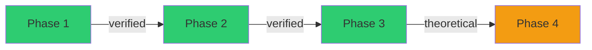

# Attack Chain: {{title}}

> Use this template when multiple findings/data points can chain. During recon, validation, or route planning, start with [[Template - Target Work DAG]] and promote only the exploit-chain lane here.

## Process Edge List

> Keep this table current while testing. Mermaid is for review/reporting; this table is the durable working state.

| from | edge | to | status |
|---|---|---|---|
| Finding / data | exploit or capability gained | next capability / impact | ⏳ |

## Chain Diagram



## Phase Details

### Phase 1: {{name}} ✅

- **Finding:** `[[]]`
- **Command:**
```bash
```
- **Output:** Confirmed

### Phase 2: {{name}}

- **Finding:** `[[]]`
- **Prerequisite:** Phase 1 output
- **Command:**
```bash
```

## Chain Impact

| Without chain | With chain |
|---------------|-----------|
| | |

## Break Points

> [!warning] Where the chain might fail

-

## Lessons Learned

-
