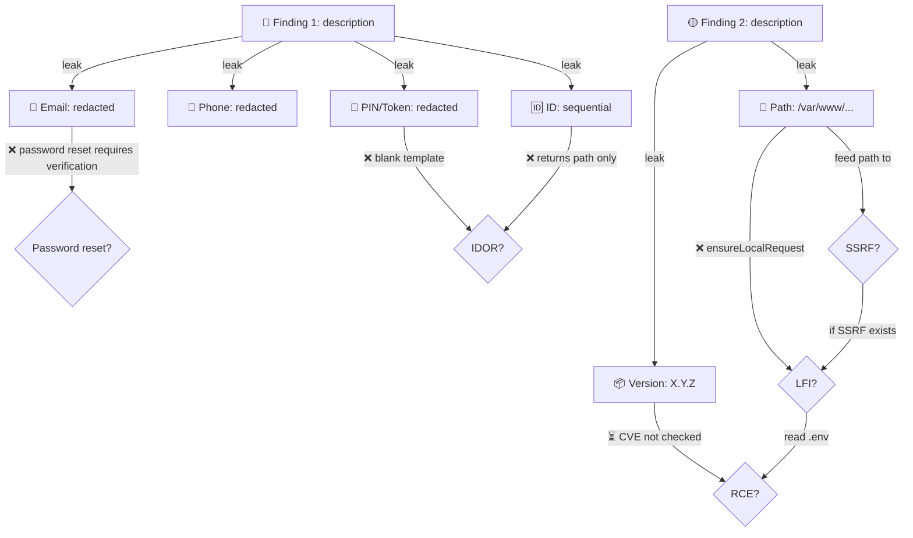

# {{name}} — Exploit Chain DAG

> [!info] All targets must have this file (mandatory)
> The DAG is a record, not a driver. Even a single finding should have one — it forces you to think about chaining possibilities and track coverage.

> Attack-path DAG (= Attack Path Analysis): node = state/finding/leaked data, edge = exploit ("what can this data do?").
> **When to use: build when you have >=2 potentially chainable findings or a multi-system target; skip for a single isolated finding (nothing to chain).**
> **Usage: during hunting, maintain only the edge-list below (incremental, low cost); render Mermaid only at the end when writing the report.**
> For recon / validation / pentest route phases, use [[Template - Target Work DAG]] first; this template only covers the exploit-chain lane.
> Status markers: ✅ tested+works / ❌ tested+dead / ⏳ untested / 🔴 exploitable

## In-progress: edge-list (incremental — append each new discovery)

> The point is to let **A→B→C chains emerge naturally**: having both `A→B` and `B→C` rows makes the `A→C` chain visible.

| from (state/finding) | --edge (what can be done)--> | to (new state/capability) | status |
|---|---|---|---|
| Unauthenticated visitor | source map leak | 6 internal endpoints | ✅ |
| Internal endpoint | IDOR | other user's data | ⏳ |
| (append...) | | | |

**Wrap-up self-check**: Can any two edges in the list chain into a higher severity? Are there any ⏳ edges on critical paths left untested?

**Automation**: `bash automation/dag_gaps.sh <target> --kind chain` (legacy entry `chain_gaps.sh` still works)

## End-of-engagement: Mermaid (render only when writing reports/visualizing — not needed during hunting)

## Node List

| Node | Type | Status | Description |
|------|------|--------|-------------|
| F1 | Finding | 🔴 | (fill in first finding) |
| D1 | Data | ⏳ | (fill in leaked data) |
| E1 | Exploit | ❌ | (fill in exploitation attempt) |

## Edge List (every edge must be tested)

| From → To | Test Method | Result | Notes |
|-----------|------------|--------|-------|
| F1 → D1 | API read | ✅ | 8 email addresses |
| D1 → E1 | /user/password reset | ❌ | requires username |
| D3 → E2 | /download/pickup?pin= | ❌ | returns blank template regardless of PIN |

## How to Use

1. **Find the first finding** → create F1 node + all Data nodes
2. **For each Data node** → list all possible Exploit edges
3. **Test each edge** → mark ✅/❌/⏳
4. **New discovery** → add new node, connect to existing graph
5. **All ⏳ become ✅/❌** → only then can you claim "chain testing complete"

## Relationship with bb-exploit-chain skill

The skill's 6 questions are a **quick thinking framework**; the DAG is **persistent tracking**:
- Q1 (identifiers) → DAG's Data nodes
- Q2 (read→write) → DAG's Exploit edges
- Q3 (other endpoints) → DAG adds new edges
- Q4 (cross-system) → DAG adds new Data→Exploit edges to other systems
- Q5 (escalate severity) → DAG shows chain depth
- Q6 (same root cause) → DAG copies subgraph to other systems
