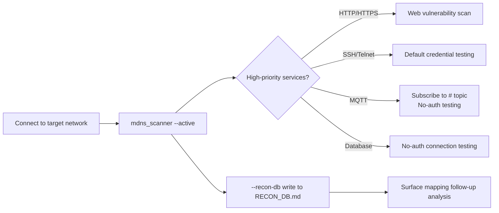

# Tool — mDNS Scanner

> Script location: `05 - Tools/mdns_scanner.py`  
> Dependencies: Python 3.8+, stdlib only (no external packages)

---

## mDNS Protocol Overview

### What is mDNS?

**Multicast DNS (RFC 6762)** is a foundational protocol for zero-configuration networking (zeroconf), allowing devices on a local network segment to discover each other without a DNS server.

| Property | Value |
|----------|-------|
| Protocol | UDP |
| Port | 5353 |
| IPv4 multicast | `224.0.0.251` |
| IPv6 multicast | `ff02::fb` |
| TTL | 255 (does not cross routers) |
| Common implementations | Apple Bonjour, Linux Avahi, Windows mDNS |

### DNS-SD (RFC 6763)

DNS Service Discovery builds on mDNS and defines the naming format for service types:

```
_<service>._<proto>.local.

PTR record:  _http._tcp.local.  →  My Web Server._http._tcp.local.
SRV record:  My Web Server._http._tcp.local.  →  host=device.local. port=80
TXT record:  My Web Server._http._tcp.local.  →  ["path=/","version=2.1"]
A record:    device.local.  →  192.168.1.100
```

### Query Flow

```
Client                              Network (multicast)
  |                                      |
  |  PTR query: _http._tcp.local.?       |
  | ─────────────────────────────────►   |
  |                                      |
  |          PTR: My Device._http._tcp.  |
  | ◄─────────────────────────────────   |
  |                                      |
  |  SRV + TXT + A follow-up queries     |
  | ◄────────────────────────────────►   |
```

---

## Bug Bounty Security Significance

### 1. High-Priority Attack Surfaces

| Service Type | Security Implication |
|-------------|---------------------|
| `_http._tcp` / `_https._tcp` | Undocumented web management interfaces |
| `_ssh._tcp` | Device SSH service (default credential testing surface) |
| `_rdp._tcp` / `_vnc._tcp` | Remote desktop exposure |
| `_mqtt._tcp` | IoT MQTT broker (often unauthenticated) |
| `_homekit._tcp` / `_hap._tcp` | Apple HomeKit devices (HAP vulnerabilities) |
| `_redis._tcp` / `_mongodb._tcp` | Database internal network exposure |
| `_telnet._tcp` | Plaintext remote access |
| `_management._tcp` | OEM management console |

### 2. TXT Record Information Leakage

Commonly leaked content:
```
model=RT-AX88U fw=3.0.0.4.386_41953   ← Firmware version → CVE precheck
admin=true path=/admin                  ← Admin path
serial=Q1234567890                      ← Serial number (OSINT)
rpBA=AB:CD:EF:01:23:45                  ← MAC address
```

### 3. Device Fingerprinting

TXT + SRV record combinations can typically determine:
- Device vendor + model
- Firmware version
- Open service list
- Internal hostname naming conventions

### 4. Internal Network Service Enumeration

The `_services._dns-sd._udp.local.` PTR query lists all known service types on the network segment, serving as a "global directory" for service enumeration.

---

## Usage

```bash
# Basic: passive listening for 30 seconds (no root required)
python3 "05 - Tools/mdns_scanner.py"

# Active: send PTR queries for all service types
python3 "05 - Tools/mdns_scanner.py" --active

# Extended window (complex network segments need more time)
python3 "05 - Tools/mdns_scanner.py" --active -t 120

# JSON output → jq filter for high-priority items
python3 "05 - Tools/mdns_scanner.py" --active --json | jq '.[] | select(.high_interest)'

# Output in RECON_DB Markdown format
python3 "05 - Tools/mdns_scanner.py" --active --recon-db >> workshop/<target>/RECON_DB.md

# Display all queried service type list
python3 "05 - Tools/mdns_scanner.py" --services

# Display raw DNS records (debug / deep-dive mode)
python3 "05 - Tools/mdns_scanner.py" --active -v
```

### macOS Notes

macOS `mDNSResponder` already occupies port 5353; the tool uses `SO_REUSEPORT` to share it.  
If you encounter `PermissionError`:

```bash
sudo python3 "05 - Tools/mdns_scanner.py" --active
```

Or use the built-in `dns-sd` for quick confirmation:

```bash
# Enumerate all service types
dns-sd -B _services._dns-sd._udp local.

# Query a specific service
dns-sd -B _http._tcp local.

# Resolve a specific instance
dns-sd -L "My Device" _http._tcp local.
```

---

## Output Example

### Table Output

```
Pri  Service Type                            Instance Name                             Host/IP               Port    TXT
─────────────────────────────────────────────────────────────────────────────────────────────────────────────────────
🔴   http._tcp                             ASUS RT-AX88U Web Console                192.168.1.1           80      path=/ fw=3.0.0.4.386
🔴   ssh._tcp                              RT-AX88U SSH                              192.168.1.1           22
🔴   mqtt._tcp                             Mosquitto MQTT Broker                     192.168.1.105         1883    version=2.0.12
     googlecast._tcp                        Chromecast Ultra                          192.168.1.50          8009    id=abcd1234
     airplay._tcp                           Apple TV 4K                               192.168.1.51          7000    model=AppleTV6,2

⚠  High-interest services: 3
   → http._tcp  192.168.1.1:80  (ASUS RT-AX88U Web Console)
   → ssh._tcp   192.168.1.1:22  (RT-AX88U SSH)
   → mqtt._tcp  192.168.1.105:1883  (Mosquitto MQTT Broker)
```

---

## Integration into Hunting Workflow



### RECON_DB Integration Command

```bash
# Scan and write at session start
python3 "05 - Tools/mdns_scanner.py" --active --recon-db \
  >> "workshop/<target>/RECON_DB.md"
```

---

## Related Tool Comparison

| Tool | Features | Use Case |
|------|----------|----------|
| `mdns_scanner.py` | Pure Python stdlib, RECON_DB integration | Framework integration, scripting |
| `dns-sd` (macOS built-in) | Interactive, depends on system mDNSResponder | Quick confirmation |
| `avahi-browse` (Linux) | `avahi-browse -a` full enumeration | Linux VPS / VM |
| `nmap --script mdns*` | Integrated with nmap scan flow | Combined with port scan |
| `python-zeroconf` | Complete RFC implementation, IPv6 support | Requires external package |

---

## Defense Insights (Report Writing Reference)

- **mDNS is designed as a local network protocol**, TTL=255 does not cross routers, but:
  - If devices are exposed in the same broadcast domain (IoT hub, same VLAN), an attacker can enumerate all services
  - Can be used for **man-in-the-middle** (mDNS spoofing) response forgery to intercept device connections
- **Remediation recommendations**:
  - Isolate IoT devices into a separate VLAN, block cross-VLAN multicast
  - Only enable mDNS on required interfaces: `/etc/nsmb.conf` or firewall rules to restrict port 5353
  - Avoid exposing firmware version, serial number, and other device fingerprints in TXT records

---

## References

- RFC 6762 — Multicast DNS
- RFC 6763 — DNS-Based Service Discovery
- Apple Bonjour service type registry: <https://developer.apple.com/bonjour/registration-guidelines.html>
- IANA mDNS port registry: 5353/udp

---

## AirDrop AWDL Special Notes (2026-06-25 Addition)

`_airdrop._tcp` only broadcasts on the **AWDL interface (awdl0)**; standard mDNS sockets cannot see it.  
You need to use `dns-sd -i awdl0 -B _airdrop._tcp` or tcpdump on awdl0 to detect it.  
Detailed attack surface analysis: see `Tool - AirDrop Attack Surface Research.md`

---

## mDNS Attack Surface Test Results (2026-06-26 Original Research)

> Attack tool: `tools/mdns_poison_probe.py` (5 attack modules)

### Attack Matrix

| # | Attack | Result | Risk |
|---|--------|--------|------|
| 1 | **companion-link privacy leakage** | ✅ Success | rpBA=BT MAC + rpAD=AirDrop hash + rpHI/rpHA all broadcast in plaintext |
| 2 | **mDNS fake service injection** | ✅ Success | EvilDevice._airdrop._tcp appears in dns-sd browse |
| 3 | **New hostname injection** | ✅ Success | evil-redirect.local → 192.168.0.104 accepted by getaddrinfo |
| 4 | **Existing hostname poisoning** | ❌ Failed | mDNSResponder cache protection ignores forged MacBook-Pro.local |
| 5 | **Known-Answer social graph leakage** | ⚠️ Not triggered | Single-device test did not observe suppression (requires multiple devices) |
| 6 | **companion-link fake service injection** | ✅ Success | PhantomDevice appears in dns-sd browse; iPhone actively queries fake device |
| 7 | **rpAD Rainbow Table PoC** | ✅ Success | 10^8 phone number entries built in 56 seconds, lookup in 4.1us |

### Attack 1: companion-link Privacy Leakage (Passive, Zero Interaction)

**Attack method**: Passively listen on 224.0.0.251:5353 → automatically receive companion-link TXT records

**Leaked fields**:

| Field | Content | Tracking Risk |
|-------|---------|---------------|
| `rpBA` | Bluetooth MAC (real, non-randomized) | Cross-session persistent tracking |
| `rpAD` | AirDrop contact SHA256 truncated hash | Rainbow table can recover phone number/email |
| `rpHI` | Identity hash | Cross-device correlation |
| `rpHA` | Another identity hash | Cross-device correlation |
| `rpHN` | Hostname hash | Device identification |
| `rpVr` | rapportd version | Software version fingerprint |
| `rpFl` | Feature flags | Capability enumeration |

**Impact**: Any device on the same WiFi network can passively track BT MACs and contact hashes of all Apple devices.  
**Reference**: PrivateDrop (USENIX Security 2021) demonstrated that SHA256 truncated hashes can be recovered via rainbow table in milliseconds.

### Attack 2+3: mDNS Injection (Active)

**Fake service injection**: Any device can register `_airdrop._tcp`, `_companion-link._tcp` and similar services, appearing in other devices' browse results.

**New hostname injection**: Send forged A records to mDNS multicast → any `.local` domain name can be hijacked (existing names have cache protection, new names do not).

**Attack chain**:
```
attacker                    victim device
   |                             |
   |-- forge _airdrop._tcp ----->|
   |   (EvilDevice, port 8771)   |
   |                             |
   |<-- victim attempts conn ----|
   |   (TLS ClientHello)         |
   |                             |
   |-- capture contact hash ---->|
   |   (PrivateDrop attack)      |
```

### ASQUIC UUID Persistence (2026-06-26 Confirmed)

| Time | UUID |
|------|------|
| 2026-06-25 | `56170CE6-32D3-4AAF-A0A2-AA5A10CA9096` |
| 2026-06-26 | `E805E372-CD67-446D-AD95-E2E5D6E9DA85` |

→ UUID is non-persistent, regenerated on each replicatord startup → **cannot be used for long-term tracking** (security positive)

### Tools

| Tool | Mode | Purpose |
|------|------|---------|
| `mdns_poison_probe.py track` | Passive | companion-link privacy tracking |
| `mdns_poison_probe.py sniff` | Passive | mDNS query monitoring |
| `mdns_poison_probe.py spoof` | Active | mDNS A record poisoning |
| `mdns_poison_probe.py fake` | Active | Fake service registration |
| `mdns_poison_probe.py known-answer` | Passive | Known-Answer Suppression social graph leakage |
| `mdns_poison_probe.py all` | All | Sequential execution of track + sniff + known-answer |

### External Research Cross-Reference (2026-06-26 Web Research)

#### mDNS Role in Multicast Relay Attacks

[Synacktiv 2025 research](https://www.synacktiv.com/en/publications/abusing-multicast-poisoning-for-pre-authenticated-kerberos-relay-over-http-with) confirmed:
- **LLMNR** poisoning can be used for Kerberos relay (answer name forgery → SPN manipulation)
- **mDNS does not support this attack**: mDNS packets only contain responses; client cannot match to queries → cannot manipulate answer names
- **mDNS can still trigger SMB connections**: Combined with [SMB→WebDAV fallback](https://www.synacktiv.com/en/publications/taking-the-relaying-capabilities-of-multicast-poisoning-to-the-next-level-tricking) (`STATUS_LOGON_FAILURE`) → NTLM hash capture

→ **Conclusion**: mDNS is an NTLM hash capture vector in Windows AD environments, but Kerberos relay requires LLMNR. macOS/iOS are not affected by SMB fallback.

#### mDNS DDoS Amplification Attack (DrDoS)

[INCIBE-CERT analysis](https://www.incibe.es/en/incibe-cert/blog/drdos-cyberattacks-based-mdns-protocol):
- mDNS can be used for **4-10x amplification** DDoS reflection attacks
- Attack conditions: UDP 5353 externally exposed + IP spoofing
- Apple Bonjour implementation is affected if port 5353 is exposed to external networks
- Limited to local network (TTL=255), but misconfigured routers/VPNs may expose it

#### Apple mDNSResponder CVEs (2024-2025)

| CVE | Impact | Exploitation Potential |
|-----|--------|----------------------|
| CVE-2024-44183 | Sandboxed process crash mDNSResponder → Bonjour DoS | May disrupt companion-link tracking protection |
| CVE-2025-31222 | mDNSResponder LPE | Requires local access; not remotely exploitable |

#### PrivateDrop/AirCollect Cross-Reference with companion-link Research (2026-06-26 Correction)

- [PrivateDrop](https://privatedrop.github.io/) original research focuses on AWDL AirDrop auth handshake — **static** SHA256 hashes, vulnerable to rainbow table attack
- Our WiFi mDNS companion-link rpAD passive capture succeeded, but **rpAD uses rotating encryption (IRK ratchet)**
- Test confirmed: rpAD changed from `8abb682c0047` → `e1c1f77db528`, rpBA changed from `A0:E1:D7:48:A2:65` → `9A:49:EB:2B:2E:02`
- **Conclusion**: companion-link rpAD is not the same as AirDrop auth hash. The former rotates and is not vulnerable to rainbow table; the latter is static and can be attacked
- Apple privacy layering: passive broadcasts protected by rotating encryption; active authentication uses static hashes (PrivateDrop's attack surface)

### Defense Recommendations

1. **Isolate IoT/Apple devices in a separate VLAN**, block cross-VLAN multicast
2. **Only enable mDNS on required interfaces**: `/etc/nsmb.conf` or firewall rules to restrict port 5353
3. **companion-link privacy risk partially mitigated**: rpAD/rpBA confirmed to rotate (IRK ratchet), passive tracking is limited; however rpFl/rpVr/rpMac do not rotate and can still be used for device fingerprinting
4. **Monitor anomalous mDNS registrations**: IDS rules to detect unexpected `_airdrop._tcp` / `_companion-link._tcp` services
5. **DrDoS protection**: Ensure UDP 5353 is not externally exposed; enable BCP38 anti-spoofing at the ISP level
