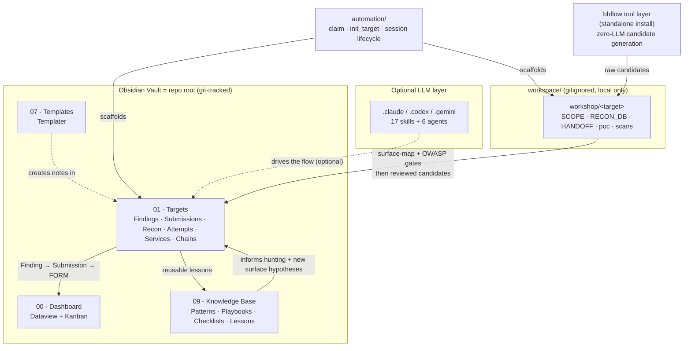
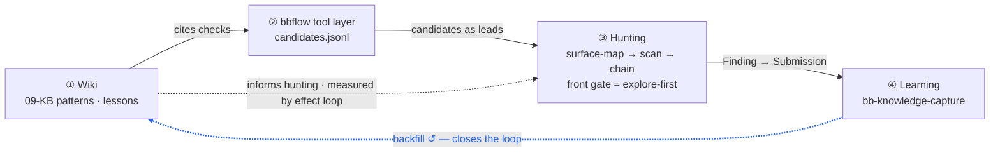

# Bug Bounty Vault Framework

An Obsidian vault that an **LLM coding agent operates** as a bug-bounty control plane — recon through disclosure. The skills, agents, and gates *are* the operating interface; the Markdown vault is the shared state the agent reads and writes.

**LLM-first:** point an agent (Claude Code / Codex CLI / Gemini CLI) at `CLAUDE.md` / `CODEX.md` / `GEMINI.md` and start hunting. It still works by hand in plain Obsidian if you prefer — that is the fallback, not the default. No target data, no findings, no secrets included.

This repository is a **public seed** for building your own private vault: start from the framework, collect your own target notes and lessons, and let it become a **self-updating private vault** over time.

## Architecture at a Glance



### The operating loop

The agent runs a four-ring loop. The blue edge (④ → ①) is what makes it a *loop* and not a throwaway pipeline: lessons feed back into the wiki so each pass is stronger.



See [docs/architecture-closed-loop.md](docs/architecture-closed-loop.md) for the four-ring closed loop in full (ring responsibilities, the explore-first rationale, the repo-boundary map), [docs/architecture.md](docs/architecture.md) for the layer-by-layer view, and [docs/workflow.md](docs/workflow.md) for the candidate lifecycle flow.

## What This Is

- **LLM-agent-operated by design** — Claude Code / Codex CLI / Gemini CLI drive it via trigger-activated skills and gates; manual operation is the fallback
- An **Obsidian vault as the top-level control plane** — not a flat file tree
- A complete **Finding → Submission → FORM** pipeline with templates and frontmatter schema
- **Session lifecycle management** with claim/release concurrency control
- **Tool layer is [bbflow](https://github.com/guan4tou2/bbflow)** — a standalone zero-LLM scanner CLI you install as a dependency (not bundled); establish it with `bb-tool-setup` / [bbflow/setup.md](bbflow/setup.md). Any contract-conforming scanner is a fallback.
- A **Knowledge Base** framework for cross-target pattern capture
- A **workspace scaffold** for local-only operational data (.gitignored)

## What This Is Not

- Not a vulnerability database or scan toolkit
- Not a collection of private bug bounty reports
- Not a runtime workspace — real data stays local and .gitignored

## Repository Layout

```
bug-bounty-vault/                     ← Obsidian Vault root + Git repo
│
├── 00 - Dashboard/                   ← Dataview dashboards, Kanban boards
├── 01 - Targets/                     ← One subfolder per target
│   └── _example/                     ← Example target structure
├── 01 - Dorks/                       ← Google dork collections
├── 05 - Tools/                       ← Vault-level tool notes, not runtime tooling
├── 07 - Templates/                   ← Obsidian templates (Templater)
├── 09 - Knowledge Base/              ← Patterns, Playbooks, Lessons Learned
├── 10 - Meta/                        ← Workspace meta notes
│
├── .claude/agents/                   ← Specialized Claude Code agents
├── .claude/skills/                   ← Claude Code skills (source of truth)
├── .codex/skills/                    ← Codex CLI skill mirrors
├── .gemini/skills/                   ← Gemini CLI skill mirrors
│
├── automation/                       ← Session lifecycle scripts
├── _automation/                      ← Pre-commit hooks
├── tools/                            ← Scanner configs (Nuclei, Osmedeus, BBOT)
├── bbflow/                           ← Automation framework contract
├── docs/                             ← Workflow documentation
├── templates/                        ← Non-Obsidian templates (handoff, op-log)
│
├── workspace/                        ← .gitignored local scratch
│   ├── workshop/<target>/            ← Per-target: SCOPE, RECON_DB, HANDOFF, poc/
│   ├── reports/drafts/               ← Local-only report/form drafts and exports
│   ├── firmware_analysis/            ← Firmware unpacking workspace
│   └── logs/                         ← Audit logs
│
├── AGENTS.md                         ← Full workflow specification
├── AGENTS_QUICK.md                   ← Token-light quick reference
├── STRUCTURE.md                      ← Directory tree + naming + frontmatter schema
├── CLAUDE.md                         ← Claude Code entrypoint
├── CODEX.md                          ← Codex CLI entrypoint
└── GEMINI.md                         ← Gemini CLI entrypoint
```

## Quick Start

```bash
# 1. Clone
git clone https://github.com/guan4tou2/bug-bounty-vault-framework.git
cd bug-bounty-vault-framework

# 2. Set up workspace (creates .gitignored local dirs)
bash automation/setup_workspace.sh

# 3. Initialize a target
bash automation/init_target.sh my-target

# 4. Open in Obsidian — point Obsidian at the repo root
#    Then install community plugins (Templater + Dataview + Kanban) via
#    Settings → Community plugins. Full guide: docs/obsidian-setup.md.
```

For the full Obsidian setup (plugins, verifying dashboards render), see [docs/obsidian-setup.md](docs/obsidian-setup.md). For optional setup choices after cloning, see [docs/post-clone-checklist.md](docs/post-clone-checklist.md).

For the public/private split, see [docs/public-vs-private.md](docs/public-vs-private.md). To add your own private downstream formatting without changing the public seed, use [docs/private-adapters.md](docs/private-adapters.md).

## Session Lifecycle

```bash
# Start session — claim scope to prevent parallel conflicts
python3 automation/start_session.py my-target

# ... do your work ...

# End session — checklist + release
python3 automation/end_session.py my-target
```

See [docs/session-lifecycle.md](docs/session-lifecycle.md) for the full protocol.

## Finding Pipeline

Every confirmed vulnerability follows:

```
Finding → Submission → FORM
```

All three share the same `finding_id`. Templates in `07 - Templates/` provide the frontmatter schema. See AGENTS.md §3 for the full specification.

## LLM Integration (primary operating mode)

This repo is **built to be driven by an LLM agent**: the skills are trigger-activated procedures and the gates enforce discipline, so the agent — not a human clicking through Obsidian — does the operating. Point one of three CLI agents at its entrypoint:

| Tool | Entrypoint | Skills |
|------|-----------|--------|
| **Claude Code** | `CLAUDE.md` → `.claude/skills/` + `.claude/agents/` | 17 skills + 6 agents |
| **Codex CLI** | `CODEX.md` → `.codex/skills/` | Mirrored from Claude |
| **Gemini CLI** | `GEMINI.md` → `.gemini/skills/` | Mirrored from Claude |

The agent reads `CLAUDE.md` / `AGENTS.md`, loads a skill when its trigger fires, and writes results back into the Markdown vault. Manual Markdown + Obsidian operation still works as a **fallback**, but the skills/agents/gates are the intended interface.

Skills: version-cve-precheck, tool-setup, surface-mapping, web-vuln-scan, dedup-finding, cve-citation, form-writer, context-handoff, triage-response, incident-response, scope-safety-check, exploit-chain, attack-chain-review, evidence-readiness, attempt-recorder, submission-readiness, knowledge-capture, cvss-score.

Agents: attack-chain-deep-dive, bbflow-runner, pre-recon, report-writer, vault-sync.

### Recommended external skill packs

The framework also recommends installing **22 third-party hunting skills** from `yaklang/hack-skills` (covering JWT/SSRF/XSS/IDOR/SAML/OAuth/business-logic/WAF-bypass and more). They are **not bundled** — install via `npx skills add` on a fresh clone. See `09 - Knowledge Base/Reference Card - External Skills Catalog.md` for the curated list, install commands, audit status, and the security considerations of running third-party skills.

### Tool layer: bbflow

The framework's tool layer (Ring 2) **is** the standalone [`guan4tou2/bbflow`](https://github.com/guan4tou2/bbflow) CLI (zero-LLM, BBOT/Osmedeus + pattern hunters + Nuclei templates). Install it separately and establish it with `bb-tool-setup` / [bbflow/setup.md](bbflow/setup.md). The dependency is one-directional: **bbflow runs standalone without this framework, but this framework expects bbflow.** A different scanner is a fallback only if it satisfies the same [output contract](bbflow/output-contract.md).

The `bbflow/` **directory in this repo** is *not* that tool — it is the **architecture-only flow spec** (gates, scope contract, output contract) and intentionally ships **no payloads, no hunters, no real detection templates**. Real templates live in the standalone tool, never here. See `bbflow/TOOLS.md` for the sanitized inventory.

**Important distinction** — same name, four different things:

| Name | What it is | Where real templates live |
|------|-----------|---------------------------|
| `bbflow/` (this dir) | Architecture spec — gates, scope, output contract | ❌ No real templates |
| `guan4tou2/bbflow` (standalone) | The tool layer — runnable CLI | ✅ Ships its own templates |
| Private LLM-agent tool layer | Subprocess wrappers on top of the CLI | ✅ Stays private |
| Obsidian read-only ops plugin | Vault visualization | — |

This repo is the spec; the standalone `guan4tou2/bbflow` is the implementation it expects.

## Knowledge Base

The `09 - Knowledge Base/` folder holds cross-target reusable knowledge:

- **Pattern** — Attack techniques (IDOR, CORS, OAuth, SSRF, Subdomain Takeover)
- **Playbook** — Step-by-step workflows (Recon)
- **Checklist** — Verification checklists (Pre-Submission Validation)
- **Reference Card** — Quick rules (Testing Safety Rules, Knowledge Capture Rubric)
- **Lessons Learned** — What worked, what didn't

Seed content is included as a starting point. Add your own as you learn.

New to the vault? Walk through one target end-to-end in [docs/getting-started.md](docs/getting-started.md).

## Scanner Configs

Basic configurations in `tools/`:

- `tools/nuclei/templates/` — example/seed Nuclei template *shapes* only
- `tools/osmedeus/profiles/` — Osmedeus scan profiles
- `tools/bbot/presets/` — BBOT presets

> **This repo is architecture-only / sanitized — no real detection templates, hunters, or payloads belong here.** Real, runnable Nuclei templates + the 47 pattern hunters live in the standalone tool **[`guan4tou2/bbflow`](https://github.com/guan4tou2/bbflow)** (`nuclei-templates/bb-recon/`); the autonomous-agent copies live in the private Hermes runtime (`tools/nuclei/custom-safe/`). Do **not** commit real KB-derived templates here.

These are starting points — customize for your workflow.

## Core Principles

| Principle | Summary |
|-----------|---------|
| **GET-first** | Never send POST/PUT/DELETE without understanding consequences |
| **Anti-exaggeration** | Theoretical chains must not be written as accomplished facts |
| **Dedup gate** | Read FINDINGS_QUICK_REF before creating any new Finding |
| **Isolated runner** | VPS or another isolated runner is recommended for aggressive or long-running scans |
| **KB capture** | Promote reusable lessons after every session |

## License

MIT — see [LICENSE](LICENSE).
