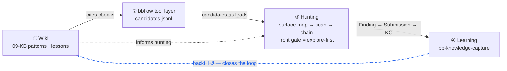

# Architecture — The Closed Loop (and what lives where)

This document exists to prevent two recurring confusions:

1. **"Is this actually a closed loop, or just a folder of notes?"** — it is a four-ring self-correcting loop; this page makes each ring and its hand-offs explicit.
2. **"Which repo does X go in — this framework, the runnable tool, or my private vault?"** — there is a hard boundary; this page draws it.

> **Direction of travel:** this framework is a **public seed migrated out of a private operational vault**. Generic structure, gates, and methodology flow **private → public after sanitization**. Operational data (targets, findings, payloads, scanner output, channel-specific forms) never flows public-ward. See [public-vs-private.md](public-vs-private.md).

---

## 1. The four rings

The system is not a pipeline with an end — it is a loop whose output makes the next pass better. The blue edge (④ → ①) is what closes it: without it you have a line that throws work away; with it the loop compounds.



<details><summary>Plain-text version (for terminals / LLM reading)</summary>

```text
            ┌──────────────────────────────────────────────────────────────┐
            │                     RING 4 — LEARNING LOOP                     │
            │   session end → Lesson / Pattern / Checklist / Wiki backfill   │
            │   gate: bb-knowledge-capture (runs even on a parked target)    │
            └───────▲──────────────────────────────────────────────┬───────┘
                    │ backfill (new Wiki page / Checklist / Pattern) │ feeds
                    │                                                ▼
   ┌────────────────┴─────────┐   reads ops pages   ┌────────────────────────────────┐
   │  RING 1 — LLM WIKI        │ ──────────────────▶ │  RING 3 — HUNTING (human + LLM) │
   │  09 - Knowledge Base/     │                     │  surface-map → scan → verify    │
   │  Patterns/Playbooks/      │ ◀────────────────── │           → review → report     │
   │  Checklists/Lessons       │   gap report        └───────▲──────────────┬────────┘
   └────────────────┬─────────┘                              │ consumes      │ produces
                    │ cites commands / templates             │ candidates    │ Finding
                    ▼                                         │               ▼
   ┌──────────────────────────┐   raw candidates    ┌────────────────────────┐
   │ RING 2 — HUNTERS          │ ──────────────────▶ │ Vault: Finding /        │
   │ zero-LLM scanners         │                     │ Submission / FORM       │
   │ (bbflow — standalone CLI) │ ◀────────────────── │ candidate gate pipeline │
   └──────────────────────────┘   scope.yaml / scale └────────────────────────┘
```

</details>

Each ring owns one thing and hands off cleanly:

| Ring | Owns | Does **not** own | Triggered by |
|---|---|---|---|
| **1 — Wiki** | Reusable commands, payload references, checklists, decision trees | Target decisions, raw data | Read by humans + LLM |
| **2 — Hunters** | Scanner runtime, scope enforcement, machine-readable candidate output | Vault schema, report prose | cron / manual / agent |
| **3 — Hunting** | Surface mapping, coverage testing, candidate verification, Finding/Submission/FORM | Raw scan logs, tool state | LLM + human |
| **4 — Learning** | Lessons, Patterns, Checklists, Wiki backfill | Report prose, target decisions | Session-end gate |

The loop is only "closed" when **Ring 4 actually runs**. A session that produces findings but skips knowledge capture has left the loop open — the next pass learns nothing.

---

## 2. Ring 3's front gate: explore-first

Ring 3 does **not** start at pattern-matching. It starts at a vuln-agnostic surface map. This is the single most-skipped, highest-value discipline in the loop.

```text
recon → bb-surface-mapping (FRONT gate) → bb-web-vuln-scan → candidate gates → Finding
        │ map every element, ask          │ OWASP A01–A10,
        │ "how could this break?"         │ version→CVE, WAF bypass
        │ BEFORE any pattern/scanner      │
```

**Why the front gate exists — the streetlight effect.** If you start from your pattern/hunter library, you only find the vuln classes those patterns already encode. The novel surface — homegrown frameworks, non-standard auth, weird parameters — is exactly where patterns are blind and where the interesting bugs live. Mapping first, vuln-agnostically, forces you to look under the whole street, not just where the lamp already shines. Patterns then run as a "did I miss a known type?" backstop, never as the starting point.

See `bb-surface-mapping` and `bb-web-vuln-scan` for the enforced method.

**"But Ring 2 is a scanner that runs first — doesn't that violate the front gate?"** No, and the distinction matters: Ring 2's recon (asset/endpoint discovery) is part of the **recon floor** that *feeds* the surface map. Its hunter/pattern hits are **leads, not findings** — they are cross-checked against the vuln-agnostic map, never auto-promoted. The front gate's "before any pattern/hunter" rule is about **what you trust as your vuln lens**, not about banning scanners from running. Order of execution (the tool may run hunters early) is not order of trust (the map still gates every candidate).

---

## 3. Two failure modes this design prevents

Both are *silent* — nothing errors, you just quietly get a worse result. The gates exist because these are the failures real sessions repeatedly hit.

| Failure | What it looks like | Guard |
|---|---|---|
| **Streetlight effect** | Jump from recon straight to "run the scanner"; only XSS/SQLi ever found; novel surface untouched | `bb-surface-mapping` front gate + `bb-web-vuln-scan` OWASP coverage; your audit/lint should fail a target with endpoints but an empty surface map |
| **Open learning loop** | Findings shipped (or target parked) but no Lesson/Pattern captured; next session re-learns the same thing | `bb-knowledge-capture` runs at session end **even on a parked / bookkeeping-only session** |

A useful self-check: if a session only *moved notes around* (promoted, parked, re-filed) it still passes through Ring 4 — "this was just housekeeping" is the exact rationalization that leaves the loop open.

---

## 4. Repo boundary — which repo does X go in?

There are three distinct things people conflate. Keep them separate.

| What | This framework repo | The runnable tool repo (`bbflow`) | Your private vault |
|---|---|---|---|
| **Nature** | Architecture-only **spec / seed** | Zero-LLM `bash + curl + python3` **CLI** that *implements* the flow | Your **operational** research system |
| **Contains** | Gate contracts, schemas, templates, methodology skills, example configs | Real recon + pattern hunters, Nuclei templates, payloads, matchers | Real targets, findings, PoCs, scanner output, channel forms |
| **Hunters / payloads / templates** | **Never** — architecture-only | **Yes** — this is where they live | Private copies / tuned variants |
| **Git visibility** | Public-safe by default | Public tool (ships its own templates) | Usually private |

**The rule that prevents the recurring mistake:** real detection templates, hunters, and payloads belong in the **runnable tool repo** (or your private tooling) — **never** in this framework repo. This framework's `bbflow/` directory is a *contract* (scope format, output contract, safety boundary, a sanitized `TOOLS.md` inventory), not a tool. A past mistake committed scanner templates into this repo and had to be reverted; the boundary above is how you avoid repeating it.

> Naming caution: the word "bbflow" appears in two places — the **runnable tool repo** (the CLI), and this framework's **`bbflow/` spec directory** (the architecture contract). "Update bbflow" almost always means the tool repo, not the spec directory. They are not the same thing.

---

## 5. How public and private stay in sync

```text
private vault  ──(sanitize)──▶  this public framework  ──(clone)──▶  someone else's private vault
     ▲                                                                      │
     └───────────────── operational data NEVER flows this way ◀────────────┘
```

- **Promote to public** only after sanitization: a safer checklist, a clearer gate, a reusable template, a generic methodology skill.
- **Keep private**: target-specific chains, channel-specific form fields, real scanner output, any finding/host/token/screenshot.
- Methodology that contains **no payloads and no target data** (like surface mapping and OWASP-coverage discipline) is a *good* upstream candidate — it is process, not operational data.

---

## 6. Is your loop actually closed? (checklist)

- [ ] Ring 2 is **established** (tool configured via `bb-tool-setup` / [`bbflow/setup.md`](../bbflow/setup.md)) and its `candidates.jsonl` lands in `workspace/` — a documented-but-unbuilt tool layer feeds nothing.
- [ ] Ring 3 started with a surface map, not a scanner run.
- [ ] OWASP coverage was completed (or items honestly marked auth-blocked) before "no findings".
- [ ] Every finding ran the chain review before the next system.
- [ ] Ring 4 ran at session end — at least one reusable Lesson/Pattern/Checklist, or an explicit "nothing reusable" decision.
- [ ] Ring 4 ran **even though** the session felt like "just housekeeping".
- [ ] No payloads / hunters / templates were committed into this framework repo.

If any box is unchecked, the loop is open — close it before ending the session.

---

## See also

- [architecture.md](architecture.md) — layer-by-layer folder view
- [workflow.md](workflow.md) — the candidate lifecycle gate flow
- [public-vs-private.md](public-vs-private.md) — the public/private boundary table
- `bbflow/` — the automation contract (scope, output, safety boundary)
- `.claude/skills/bb-surface-mapping`, `.claude/skills/bb-web-vuln-scan`, `.claude/skills/bb-knowledge-capture`
