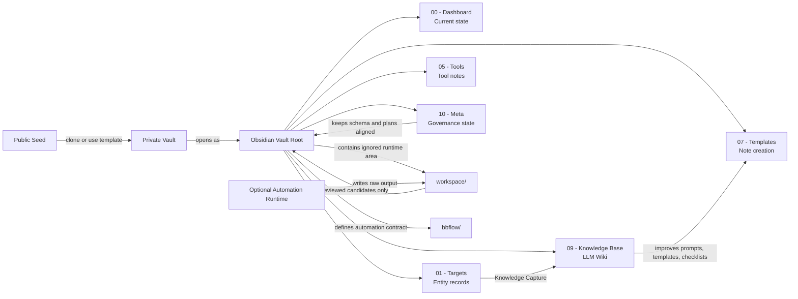
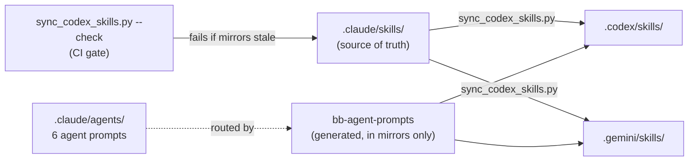

# Architecture

This project describes a reusable, private-by-default operating model for authorized security research.

## Layers

```text
Obsidian Vault Root
  Canonical notes, decisions, review-ready summaries, and reusable process knowledge.
  Main folders:
    00 - Dashboard/       Current state, Kanban, Dataview dashboards.
    01 - Targets/         Target, Finding, Submission, FORM, Recon, Attempt records.
    07 - Templates/       Obsidian templates and frontmatter scaffolds.
    09 - Knowledge Base/  LLM Wiki: reusable Patterns, Playbooks, Lessons, Reference Cards.
    10 - Meta/            Plans, fileClasses, snapshots, environment notes.

workspace/
  Ignored runtime workspace for raw artifacts, tool output, logs, proof-of-concept files, and temporary analysis.
  This replaces the older External workspace wording while keeping runtime data outside public git.
  In workflow language this is the Workspace layer.

bbflow/
  Framework contract for connecting automation output back into the vault. The public repo includes design and example configs, not scanners.

Automation
  Local checks, initialization helpers, linting, and lifecycle validation.

Optional tooling runtime
  Recon or automation tools that can run independently from the vault.
```

## Vault Folders

The Obsidian vault root contains numbered folders following Obsidian conventions:

| Folder | Purpose |
|--------|---------|
| `00 - Dashboard` | Dataview dashboards, Kanban boards, priority views |
| `01 - Targets` | One subfolder per target (Findings, Submissions, Recon, etc.) |
| `01 - Dorks` | Google dork collections |
| `05 - Tools` | Vault-level tool notes and configuration rationale; runtime toolchains stay outside the synced notes |
| `07 - Templates` | Obsidian templates (Templater) for Findings, Submissions, etc. |
| `09 - Knowledge Base` | Patterns, Playbooks, Checklists, Lessons — the LLM Wiki layer |
| `10 - Meta` | Workspace meta notes |

## Architecture Map



## Design Principles

### Vault as canonical source

The Vault stores durable, curated, review-ready information. It should contain enough context to understand what happened and why, without storing raw operational material.

### workspace/

Raw artifacts belong in the ignored `workspace/` scaffold under the Obsidian vault root. The directory exists so the private workflow has one predictable place for runtime state, but its contents are not synced back to the public seed.

### Automation as control plane

Automation should verify structure, session discipline, template shape, and public-safety boundaries. It should not require private target data.

### bbflow as framework contract

The `bbflow/` directory describes how scope, automation output, and knowledge capture connect. Public examples for Nuclei, Osmedeus, and BBOT are configuration shapes only. They provide baseline design language, not operational playbooks.

### Tooling as optional runtime

Tooling can produce machine-readable output, but the framework does not depend on any specific scanner or automation stack. Tools should be optional, replaceable, and filled in by the user after adoption.

## Source of Truth

| Need | Source |
|---|---|
| Current queue status | `00 - Dashboard/` |
| Canonical target summary | `01 - Targets/<target>/Target - <target>.md` |
| Tool usage notes | `05 - Tools/` |
| Note creation shape | `07 - Templates/` |
| Reusable generic process knowledge | `09 - Knowledge Base/` LLM Wiki |
| Structural state | `10 - Meta/` |
| Raw evidence | `workspace/` runtime directory |
| Review-ready evidence | Finding note |

## Cross-Platform Skill Sync

`.claude/skills/` is the single source of truth. The Codex and Gemini mirrors are generated — never hand-edited — by `automation/sync_codex_skills.py`. The generator also emits a `bb-agent-prompts` router skill (CLI-only) that points back at the Claude agent prompts.



Edit a skill in `.claude/skills/`, run `python3 automation/sync_codex_skills.py`, and CI enforces parity with `--check` on every push.

## Public Boundary

This public repository ends at architecture and workflow. A real deployment should keep private data in a separate private repository or local vault.
