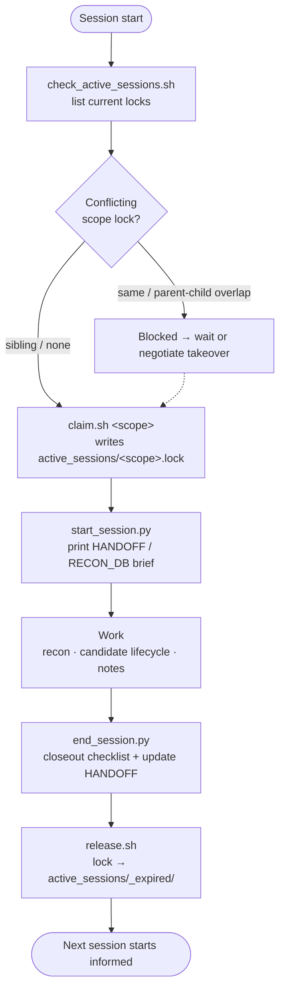

# Session Lifecycle

A bug bounty session has three phases: **claim**, **work**, and **closeout**. Every phase has mandatory checkpoints that prevent data loss, duplicate work, and stale handoffs.

This document describes the abstract workflow. The reference implementation lives in `automation/` (bash scripts) and can be replaced with any language that follows the same protocol.



---

## Phase 1: Claim (Session Start)

**Goal:** Declare your working scope so parallel sessions (human or LLM) don't collide.

### 1.1 Check for active sessions

Before touching any target, check if another session already holds a lock on the same scope:

```
check_active_sessions → list of { scope, owner, claimed_at, expected_release }
```

If a conflicting lock exists:
- **Same scope or parent/child overlap** → blocked; wait or negotiate takeover
- **Sibling scope (different target or unrelated sub-service)** → safe to proceed

### 1.2 Acquire a lock

```
claim(scope, owner, eta_minutes) → lock_file
```

**Scope hierarchy** uses `/` separators:

| Scope | Meaning |
|-------|---------|
| `_meta` | Non-target work (docs, automation, architecture) |
| `target` | Entire target locked |
| `target/sub-service` | Sub-service within a target |
| `target/sub-service/vuln-class` | Narrow vuln-class within a sub-service |

**Conflict rules:**
1. Exact match → conflict
2. New scope is prefix of existing → conflict (claiming parent while child is locked)
3. Existing scope is prefix of new → conflict (claiming child while parent is locked)
4. Different branches → no conflict

Lock files are JSON with: `session_id`, `owner`, `scope`, `target`, `claimed_at`, `last_heartbeat`, `expected_release`, `host`.

### 1.3 Read session-start brief

Load the target's handoff state from the previous session:

```
session_start_brief(target, keyword?, host?) → summary of:
  - HANDOFF.md (what was in progress, next steps, blockers)
  - FINDINGS_QUICK_REF.md (existing findings — dedup gate)
  - RECON_DB.md (credentials, paths, infra, operation log)
```

Only the high-signal sections are surfaced. Deep-read full files only when the brief points to a relevant section.

### 1.4 Dedup gate

Before opening any new Finding, check:
1. `FINDINGS_QUICK_REF.md` — does the root cause already have a Finding?
2. `RECON_DB.md` Known Artifacts — is this specific endpoint/parameter already documented?

If likely duplicate → open an **Attempt** (with `result_reason: duplicate_likely`), not a Finding.

---

## Phase 2: Work

### 2.1 Recording conventions

During the session, maintain three living documents:

| Document | What goes in | When to update |
|----------|-------------|----------------|
| **RECON_DB.md** | Credentials, paths, endpoints, infra, tech stack, operation log | Every new discovery, immediately |
| **FINDINGS_QUICK_REF.md** | One-line per Finding (ID, title, severity, status) | Auto-regenerated; manual only if script unavailable |
| **HANDOFF.md** | Session narrative: what you tried, what you learned, next steps | End of session (or mid-session at natural breakpoints) |

### 2.2 Operation log

**Before** executing any manual HTTP request (POST/PUT/PATCH/DELETE, or exploratory GET):

```markdown
| Local Time | UTC Time | Source IP | Method | Target URL | Intent | Result |
|---|---|---|---|---|---|---|
| 2026-05-22 14:30 | 2026-05-22 06:30 | 1.2.3.4 | POST | https://api.target.com/v1/users | Test IDOR on user endpoint | pending |
```

Update the `Result` column immediately after execution.

### 2.3 Hunting + finding creation flow

Hunting runs explore-first; then every candidate passes the lifecycle gates ([architecture-closed-loop.md](architecture-closed-loop.md)):

```
bb-tool-setup               # once per machine: establish the bbflow tool layer (Ring 2)

bb-surface-mapping          # FRONT gate: vuln-agnostic surface map (explore-first, never skip)
bb-web-vuln-scan            # OWASP coverage + version→CVE + WAF bypass

candidate found            # a scanner hit is a LEAD, not a Finding
→ bb-dedup-finding          # duplicate check
→ bb-scope-safety-check     # scope + safety gate
→ bb-exploit-chain          # 6-question chain on any finding (escalate before next system)
→ bb-attack-chain-review    # chain potential assessment
→ bb-evidence-readiness     # evidence completeness
→ Finding                   # create if ready
→ bb-submission-readiness   # final gate before report
→ Submission / FORM         # platform-specific output
→ bb-knowledge-capture      # Ring 4: capture reusable learning (even on a parked session)
```

Failed candidates → `bb-attempt-recorder` (preserves negative results).

Each gate is a skill in `.claude/skills/` (or equivalent manual checklist).

| Artifact | When created | By whom |
|----------|-------------|---------|
| **Finding** | After evidence-readiness gate passes | LLM auto-creates (no waiting, no batching) |
| **Submission** | After submission-readiness gate passes | LLM drafts, user confirms |
| **FORM** | User explicitly requests | LLM generates on user trigger only |

**Granularity rule:** Same endpoint + same vuln type but different parameters or resources = separate Findings.

### 2.4 Safety boundaries

| Action | Policy |
|--------|--------|
| GET / HEAD / OPTIONS | Execute freely |
| POST (read-only query) | Confirm no side effects, then execute |
| POST (write) / PUT / PATCH | Confirm consequences first; use an isolated runner when risk is non-trivial |
| DELETE (not self-created data) | Never execute |
| Bulk automated scanning | Isolated runner/VPS recommended (bbflow, nuclei, ffuf, sqlmap, osmedeus) |

---

## Phase 3: Closeout (Session End)

### 3.1 End-of-session brief

Generate a machine-readable summary of what changed this session:

```
session_end_brief(scope) → diff summary:
  - New/modified findings
  - RECON_DB changes
  - Uncommitted files
  - Knowledge capture status
```

### 3.2 Checklist

Run through mandatory checks before releasing the lock:

| # | Check | Pass condition |
|---|-------|---------------|
| 1 | RECON_DB.md freshness | Updated within this session |
| 2 | Vault Recon note sections | Required sections filled (if Recon note exists) |
| 3 | Knowledge capture | New learnings recorded (Lessons Learned / Pattern / Playbook) |
| 4 | Kanban / Dashboard sync | Board reflects current Finding statuses |
| 5 | Uncommitted changes | All session work committed (or explicitly deferred) |
| 6 | FINDINGS_QUICK_REF regenerated | Reflects any new Findings created this session |
| 7 | HANDOFF.md updated | Next session can cold-start from this document |

### 3.3 Update HANDOFF.md

Fill in all sections:
- **What you were doing** (one sentence)
- **Immediate next step** (copy-pasteable command)
- **Blockers** (if any)
- **In-progress leads** (not yet Finding-worthy)
- **What you learned** (architecture insights, not findings)
- **Context notes** (anything the next session needs but won't find in git log)

### 3.4 Release lock

```
release(scope) → lock moved to expired/
```

The lock file is moved (not deleted) to an `_expired/` directory for audit trail.

---

## Concurrency Model

Multiple LLM sessions (or human + LLM) can work the same vault simultaneously if their scopes don't overlap:

```
Session A: claim("gitlab/oauth")     ← locks gitlab/oauth
Session B: claim("gitlab/graphql")   ← OK, sibling scope
Session C: claim("gitlab")           ← BLOCKED, parent of A and B
Session D: claim("zoom")             ← OK, different target
```

Locks have a `last_heartbeat` and `expected_release`. Stale locks (heartbeat > 2x ETA) can be force-claimed with `--force` or `--takeover`.

---

## Script Reference

| Script | Phase | Purpose |
|--------|-------|---------|
| `check_active_sessions.sh` | Claim | List all active locks |
| `claim.sh <scope>` | Claim | Acquire scope lock |
| `session_start_brief.sh <target>` | Claim | Token-efficient handoff summary |
| `init_target.sh <target>` | Claim | Bootstrap new target workspace |
| `session_end_brief.sh <scope>` | Closeout | Summarize session changes |
| `session_end_checklist.sh <target>` | Closeout | Mandatory pre-release checks |
| `release.sh <scope>` | Closeout | Release scope lock |

Minimal Python equivalents: `start_session.py`, `end_session.py`, `check_vault.py` (see `automation/`).
