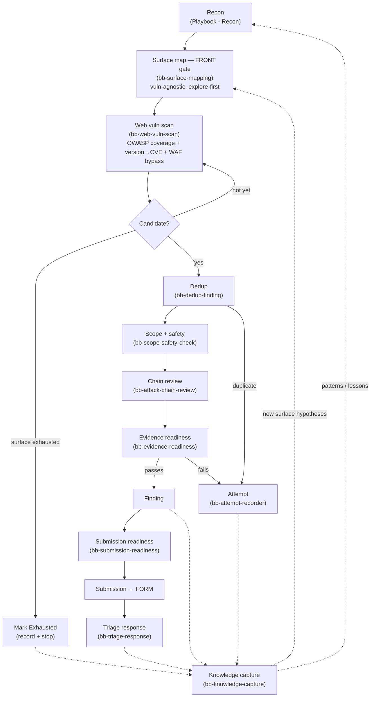

# Workflow

The generic lifecycle is:

```text
Target -> Recon -> Finding -> Review -> Knowledge Capture
```

## Candidate Lifecycle

Every candidate passes the same gates before becoming a submission. Each gate maps to an optional LLM skill (named in parentheses) and can also be run by hand.



> The two gates between Recon and Candidate are the **most-skipped and most-valuable** part of the loop. Jumping straight from recon to pattern-matching is the "streetlight effect" — you only find the vuln classes your patterns already know. `bb-surface-mapping` forces a vuln-agnostic map first; `bb-web-vuln-scan` then enforces full OWASP coverage so testing is not just XSS + SQLi. See [docs/architecture-closed-loop.md](architecture-closed-loop.md).

## Gates

Each gate can be performed manually or via the corresponding LLM skill.

### Surface mapping gate — FRONT gate (`bb-surface-mapping`)

After recon and **before any pattern/hunter/scan**, map the full attack surface vuln-agnostically: one row per surface element (endpoint, parameter, role, state transition, trust boundary, integration, dependency, file/upload, business flow, anomaly), each with a free-text "how could this break?" hypothesis. A target with discovered endpoints but an empty surface map is incomplete. This counters the streetlight effect — patterns are a post-mapping checklist, not the search starting point.

### Coverage gate (`bb-web-vuln-scan`)

After mapping, test for vulnerabilities with full OWASP Top 10 coverage, a complete injection matrix per parameter, version→CVE lookup, and WAF-bypass discipline. A target may only be marked Exhausted when every OWASP category is tested (or genuinely auth-blocked) and every finding has run the chain review.

### Safety gate (`bb-scope-safety-check`)

Confirm authorization, scope, and testing constraints before any active work.

### Dedupe gate (`bb-dedup-finding`)

Check whether the same host, feature, primitive, or root cause has already been investigated.

### Chain review gate (`bb-attack-chain-review`)

Assess whether a candidate can chain into higher impact before finalizing a Finding.

### Evidence gate (`bb-evidence-readiness`)

Do not promote a candidate into a Finding until the evidence is reproducible, scoped, and minimally documented.

### Submission gate (`bb-submission-readiness`)

Final check before creating a Submission or FORM: dedupe, scope, evidence, severity, platform fit, and report hygiene.

### Knowledge capture gate (`bb-knowledge-capture`)

Capture what can be reused: decision points, false-positive filters, stop conditions, and workflow lessons.

### Attempt recording (`bb-attempt-recorder`)

When a candidate fails any gate, record the negative result to prevent repeated effort.

## Lifecycle

1. Create or select a target placeholder.
2. Confirm scope and allowed testing behavior.
3. Run recon in an external workspace.
4. Record a recon note with tools, scope, decisions, and outputs.
5. **Map the attack surface vuln-agnostically** (front gate) before any pattern/scan.
6. **Test with full OWASP coverage** (version→CVE, injection matrix, WAF bypass); mark Exhausted only when coverage is complete.
7. Promote validated issues into findings.
8. Review findings for evidence quality, risk, and duplicate likelihood.
9. Record the review decision in a review note.
10. Optionally create a platform-neutral submission or form bundle for private downstream use.
11. Feed reusable lessons back into the LLM Wiki.

## Close-Out

Before ending work:

- Release any active ownership lock if your private implementation uses one.
- Record what was done and what remains.
- Move raw artifacts out of the public Vault boundary.
- Update reusable generic lessons only after sanitization.
